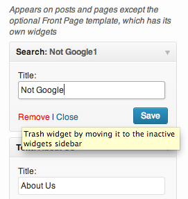

<!-- DO NOT EDIT THIS FILE; it is auto-generated from readme.txt -->
# Widget Customizer

Edit widgets and preview changes in Theme Customizer, with a control for each widget form in sections added for each sidebar rendered in the preview.

**Contributors:** [x-team](http://profiles.wordpress.org/x-team), [westonruter](http://profiles.wordpress.org/westonruter), [johnregan3](http://profiles.wordpress.org/johnregan3), [akeda](http://profiles.wordpress.org/akeda), [topquarky](http://profiles.wordpress.org/topquarky), [bobbravo2](http://profiles.wordpress.org/bobbravo2), [ricardocorreia](http://profiles.wordpress.org/ricardocorreia)  
**Tags:** [customizer](http://wordpress.org/plugins/tags/customizer), [widgets](http://wordpress.org/plugins/tags/widgets), [sidebars](http://wordpress.org/plugins/tags/sidebars), [preview](http://wordpress.org/plugins/tags/preview)  
**Requires at least:** 3.6  
**Tested up to:** 3.7  
**Stable tag:** trunk (master)  
**License:** [GPLv2 or later](http://www.gnu.org/licenses/gpl-2.0.html)  

## Description ##

***NEW:*** *You may now add widgets while in the customizer. With that, you can now add, reorder, reassign, update, and delete widgets all within the customizer and preview all changes before making them live.*

**This plugin is being developed as part of the Widgets UI Refresh feature-as-plugin group. We're hoping it will be accepted into WordPress Core for the 3.9 release, so we are targeting presentation for inclusion in the release at the beginning of the 3.9 development cycle tentatively in December 2013.**

Widgets in WordPress provide an easy way to add functionality to predefined areas of your theme templates. However, once you add a widget to a sidebar you have to leave the WordPress admin to go back to the frontend to actually see how the updated widget appears in the sidebar on your site's public frontend. While you are making these changes and experimenting with a widget, it could be completely broken and everyone visiting your site will see this broken widget since there is no core way to preview changes made to widgets. But WordPress also provides an excellent way to preview changes to various settings on your site via the Theme Customizer. Changes made when using the Customizer are not visible to site visitors until you hit Save & Publish. So what if widgets could be edited in the Theme Customizer? That's what this plugin makes possible.

Each registered sidebar on your site will get its own section in the Theme Customizer panel. Within each Sidebar Widgets section, each widget added to the sidebar will appear in order and its widget form will appear there just as it appears when editing widgets in the WordPress widgets admin page. Upon making a change to the widget form, press the form's Update button to then see the changes in the preview window and to stage the widget changes for committing once the **Save & Publish** button is clicked. Again, changes made when in the Theme Customizer do not appear until you hit this button. This goes for whether you're adding a new widget, editing existing widgets, reordering widgets, dragging widgets to other sidebars, or even removing widgets from the sidebars entirely: all of these actions are previewable.

When you remove a widget from a sidebar, it is not deleted. Instead, it is moved from an active sidebar to the "Inactive Widgets" sidebar which can currently be seen on the widgets admin page. As such, removing a widget now is the same as trashing a widget.

Customizer control sections for sidebars will be shown or hidden dynamically when the the preview window is initially loaded or when navigating the site within the preview window, based on whether or not the sidebar got rendered in the previewed page. Only sidebars which can be previewed will be shown in the customizer panel.

No longer do you have to edit your widgets blind!

And here's an **awesome bonus**: since the widgets are registered as settings in the customizer, if you also have the [Settings Revisions](http://wordpress.org/plugins/settings-revisions/) plugin also activated, the widgets will then get versioned! Each time you save your changes, the current instance of each widget will be saved in a revision, and you can restore a previous widget state by rolling back the settings revision.

**Development of this plugin is done [on GitHub](https://github.com/x-team/wp-widget-customizer). Pull requests welcome. Please see [issues](https://github.com/x-team/wp-widget-customizer/issues) reported there before going to the plugin forum.**

## Screenshots ##

### Before any changes have been made; widgets appear in sections corresponding to their assigned sidebars

### After a change is made, the widget's Update button is pressed to then see changes in preview and so changes can be published

### Widgets can be added in sidebar sections; widgets get added to the top, and can be dragged into the desired location

### Widgets can be trashed while in customizer, causing them to be moved to the Inactive Widgets sidebar

### Widgets are be rearranged by drag-and-drop, and widgets can be assigned to other sidebars by dragging them over

### I DON'T ALWAYS TEST MY WORDPRESS WIDGETS IN PRODUCTION, BUT WHEN I DO I USE THE WIDGET CUSTOMIZER PLUGIN

## Changelog ##

### 0.9.2 ###
* Fix addition of previously-uninstantiated widgets to previously-empty sidebars. It was not possible to add new widgets to a fresh install. Props [westonruter](http://profiles.wordpress.org/westonruter/).

### 0.9.1 ###
* Render widget control templates into DOM for plugins to manipulate. The Jetpack Widget Visibility module expects the widget templates to be rendered into the DOM as hidden elements so that it can inject the "Visibility" button in the proper place. So we have to move the templates from the model and into the DOM for compat. Other plugins probably do this as well. Props [westonruter](http://profiles.wordpress.org/westonruter/).

### 0.9 ###
* Add support for adding new widgets in the customizer. Widgets can now be added, reordered, modified, and deleted all in the customizer preview, without impacting any visitor to the site until you hit **Save & Publish**. Props [westonruter](http://profiles.wordpress.org/westonruter/). Fixes [#3](https://github.com/x-team/wp-widget-customizer/issues/3).
* Widgets in the customizer are now all properly model-driven, meaning that changes to the settings will trigger changes to the controls. This ensures that the [Settings Revisions](wordpress.org/plugins/settings-revisions/) can work as expected, even allowing you to restore previously trashed widgets and restore previous widget orderings and sidebar placements. Props [westonruter](http://profiles.wordpress.org/westonruter/).
* Improve compatibility with plugins that add and extend widgets; the Jetpack Widget Visibility module now works fully in the customizer.  Props [westonruter](http://profiles.wordpress.org/westonruter/). Fixes [#39](https://github.com/x-team/wp-widget-customizer/issues/39).
* Change widget button from primary **Save** to secondary **Update** button. Props [westonruter](http://profiles.wordpress.org/westonruter/). Fixes [#40](https://github.com/x-team/wp-widget-customizer/issues/40).
* Attempt to prevent widgets from forcing their controls to be wide. Props [westonruter](http://profiles.wordpress.org/westonruter/). See [#18](https://github.com/x-team/wp-widget-customizer/issues/18).
* Update styles for compatibility with MP6. Props [westonruter](http://profiles.wordpress.org/westonruter/). See [#33](https://github.com/x-team/wp-widget-customizer/issues/33).
* Add initial unit tests. Props [akeda](http://profiles.wordpress.org/akeda/) (gedex). Fixes [#25](https://github.com/x-team/wp-widget-customizer/issues/25).

### 0.8 ###
* Remove (trash) widgets from sidebars in the customizer and preview their removal before publishing the change. Removed widgets are moved to the Inactive Widgets sidebar accessible on the widgets admin page. Props [topquarky](http://profiles.wordpress.org/topquarky/) (TrevorMills), [westonruter](http://profiles.wordpress.org/westonruter/). Fixes [#22](https://github.com/x-team/wp-widget-customizer/issues/22).
* Add keyboard-accessible way to expand/collapse widget form controls. Props [topquarky](http://profiles.wordpress.org/topquarky/) (TrevorMills). Fixes [#26](https://github.com/x-team/wp-widget-customizer/issues/26).
* Add move cursor when hovering over widget form controls. Props [westonruter](http://profiles.wordpress.org/westonruter/).
* Feature link to Customizer on the Widgets admin page. Props [johnregan3](http://profiles.wordpress.org/johnregan3/). Fixes [#29](https://github.com/x-team/wp-widget-customizer/issues/29).

### 0.7 ###
* Make detection of sidebars in previewed template more robust by integrating new temp hooks available in trunk. Fixes [#15](https://github.com/x-team/wp-widget-customizer/pull/15).
* Allow widget form controls to be dragged to other sidebar sections. Fixes [#24](https://github.com/x-team/wp-widget-customizer/pull/24).
* Eliminate duplicated code by re-using `wp_widget_control()`
* Add PHPCS, JSHint, and Travis CI integration

### 0.6 ###
Add drag-and-drop reordering of customizer controls, where the new order is itself previewed and is persisted until the settings are saved. Fixes issue [#1](https://github.com/x-team/wp-widget-customizer/pull/1). Props [bobbravo2](http://profiles.wordpress.org/bobbravo2/), [westonruter](http://profiles.wordpress.org/westonruter/).

### 0.5 ###
Hovering over widgets in preview highlights corresponding customizer sections and controls in panel. Clicking a widget in preview opens widget form in panel and focuses on first input. Interacting with widget form highlights widget in preview. Note that this issue resolves a major usability problem illustrated by the [user test video](http://make.wordpress.org/ui/2013/09/18/widgets-sept-16-chat-notes/#comment-23907). Fixes issue [#5](https://github.com/x-team/wp-widget-customizer/pull/5). Props [ricardocorreia](http://profiles.wordpress.org/ricardocorreia/), [westonruter](http://profiles.wordpress.org/westonruter/).

### 0.4 ###
Render widget form controls in a collapsed state (with a toggle) as on the widgets admin page; add in-widget-title ([#7](https://github.com/x-team/wp-widget-customizer/issues/7)). Props [johnregan3](http://profiles.wordpress.org/johnregan3/).

### 0.3 ###
* Add banner image ([#10](https://github.com/x-team/wp-widget-customizer/issues/10)). Props [johnregan3](http://profiles.wordpress.org/johnregan3/).
* Eliminate warning with an array type check

### 0.2 ###
Only show customizer sections for sidebars which can currently be seen in the preview; sections show/hide dynamically as the preview frame is navigated.

### 0.1 ###
First Release

